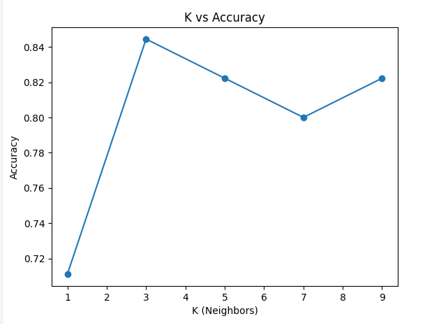
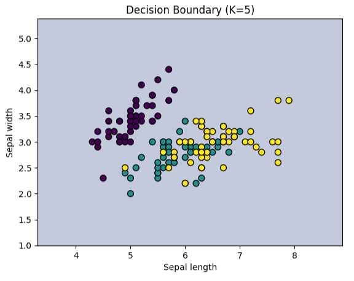

# K-Nearest Neighbors (KNN) Classification

##  Project Overview
This project applies **K-Nearest Neighbors (KNN)** on iris dataset.  
The workflow includes feature normalization, model training, evaluation, and visualization of decision boundaries for different values of K.

---
##  Technologies Used
- Python
- Pandas
- NumPy
- Matplotlib
- Plotly
- Scikit-learn

---
## Steps Implemented

1. **Normalize Features**

 - Applied StandardScaler from sklearn.preprocessing to scale features.

 - Normalization ensures all features contribute equally to distance calculations.

2. **Train KNN Classifier**

 - Used KNeighborsClassifier from sklearn.neighbors.

 - Experimented with different values of K (e.g., 1, 3, 5, 7) to analyze model performance.

3. **Model Evaluation**

 - Evaluated the classifier using:

 - Accuracy score: sklearn.metrics.accuracy_score

 - Confusion matrix: sklearn.metrics.confusion_matrix

4. **Decision BoundaryVisualization**

 - Plotted decision boundaries to visualize how K affects the classifier.

 - Helps in understanding the effect of neighbors on classification regions.
---

 ##  Results & Visualizations
 ### 1. K vs Accuracy

  ### 2. Decision Boundary

---
## Conclusion

- The K-Nearest Neighbors (KNN) algorithm is a simple yet effective classification technique that relies on the distance between data points.

- Feature normalization is important to ensure all features contribute equally to the distance calculation.

- The choice of K significantly affects model performance:

   - Small K values may lead to overfitting.

   - Large K values may smooth out class boundaries and underfit.

- The K vs Accuracy plot helps identify the optimal K for the dataset.

 - Decision boundary visualization provides an intuitive understanding of how the classifier separates different classes.
